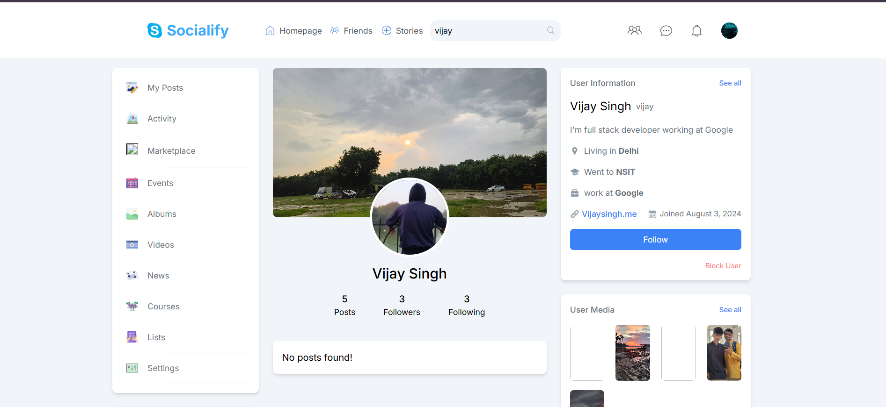
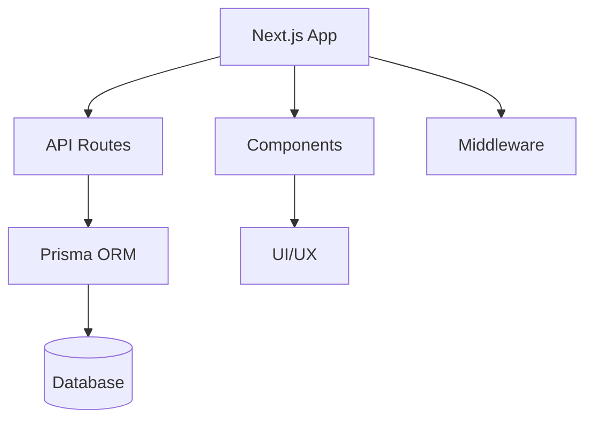
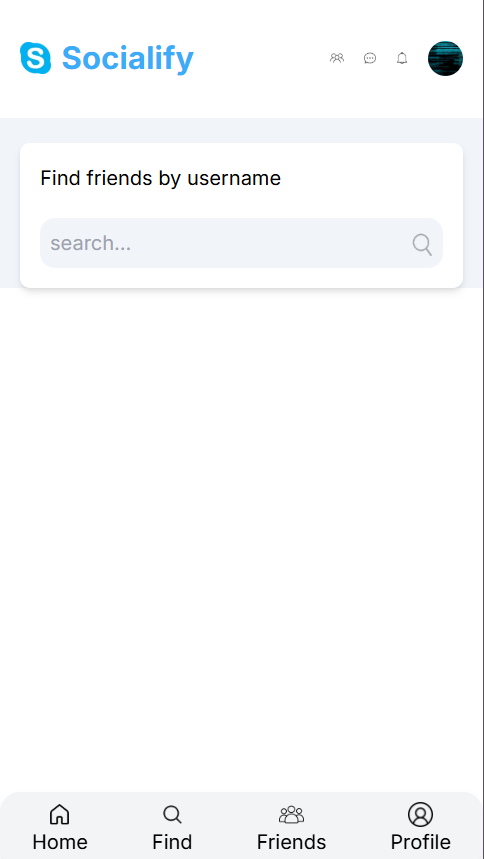

# Socialify - social media platform



## Overview

Socialify is a modern, full-stack social media starter built with Next.js, Prisma, and Tailwind CSS. It provides a robust foundation for building scalable, feature-rich social networking applications. The project is designed with modularity, performance, and developer experience in mind, making it easy to extend and customize for your unique requirements.

---

## Table of Contents

- [Features](#features)
- [Architecture](#architecture)
- [Project Structure](#project-structure)
- [Tech Stack](#tech-stack)
- [Getting Started](#getting-started)
- [Screenshots](#screenshots)
- [Contributing](#contributing)
- [License](#license)

---

## Features

- User authentication (sign up, sign in)
- User profiles with customizable avatars and covers
- Post creation, editing, and deletion
- Commenting and likes on posts
- Friend requests and friend lists
- Stories, events, and groups
- Responsive design for mobile and desktop
- Modern UI with Tailwind CSS
- API routes for backend logic

---

## Architecture

The application follows a modular, layered architecture for scalability and maintainability:



- **Next.js App**: Handles routing, SSR, and static generation.
- **API Routes**: Backend logic for authentication, posts, comments, etc.
- **Prisma ORM**: Database access and schema management.
- **Database**: Stores users, posts, comments, etc.
- **Components**: Reusable UI elements (Navbar, Feed, Post, etc.).
- **Middleware**: Handles authentication, logging, and other cross-cutting concerns.

---

## Project Structure

```
├── prisma/                # Prisma schema and migrations
├── public/                # Static assets (images, icons)
├── src/
│   ├── app/               # Next.js app directory (pages, layouts, API)
│   ├── components/        # Reusable React components
│   ├── lib/               # Utility functions and server actions
│   └── middleware.tsx     # Middleware for authentication, etc.
├── package.json           # Project metadata and scripts
├── tailwind.config.ts     # Tailwind CSS configuration
├── tsconfig.json          # TypeScript configuration
└── ...
```

---

## Tech Stack

- **Frontend**: Next.js, React, Tailwind CSS
- **Backend**: Next.js API Routes, Prisma ORM
- **Database**: (Configurable, e.g., PostgreSQL, MySQL, SQLite)
- **Authentication**: Clerk (or your preferred provider)
- **TypeScript**: Type safety throughout the codebase

---

## Getting Started

1. **Clone the repository:**
   ```sh
   git clone https://github.com/Vijaysingh1621/Socialify-.git
   cd next-social-starter
   ```
2. **Install dependencies:**
   ```sh
   npm install
   ```
3. **Configure environment variables:**
   - Copy `.env.example` to `.env` and fill in your database and authentication credentials.
4. **Run database migrations:**
   ```sh
   npx prisma migrate dev
   ```
5. **Start the development server:**
   ```sh
   npm run dev
   ```
6. **Open the app:**
   - Visit [http://localhost:3000](http://localhost:3000) in your browser.

---


## Screenshots

### Home Feed


### Profile Page


### Mobile Friendly
Socialify is fully responsive and mobile-friendly. Below is a screenshot of the mobile view:


*Replace `public/image.png` and `public/image2.png` with your own screenshots for better representation.*

---

## Contributing

Contributions are welcome! Please open issues and submit pull requests for new features, bug fixes, or improvements. For major changes, please open an issue first to discuss what you would like to change.

---

## License

This project is licensed under the MIT License. See the [LICENSE](LICENSE) file for details.

---

## Contact

For questions or support, please contact [Vijaysingh1621](https://github.com/Vijaysingh1621).

---

## Diagram

Below is a high-level architecture diagram for Socialify:

```
+-------------------+
|   User Browser    |
+-------------------+
          |
          v
+-------------------+
|   Next.js Pages   |
+-------------------+
          |
          v
+-------------------+
|   API Routes      |
+-------------------+
          |
          v
+-------------------+
|   Prisma ORM      |
+-------------------+
          |
          v
+-------------------+
|   Database        |
+-------------------+
```

---

*Happy coding!*
